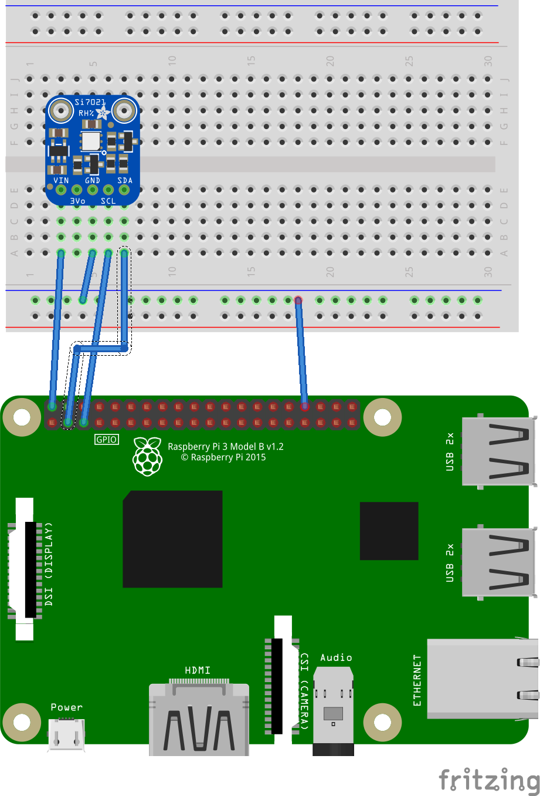

# Adafruit SI7021 Temperature and Humidity Sensor Driver for Android Things

I'm tyrying to get my SI7021 sensonr working. So I started by making a Driver and a quick app to get it going.

### What I have achieved so far

I started with the [Android Things weather station sample application](https://github.com/androidthings/weatherstation), then modified it to match my own Driver.

Establishing a connexion to the sensor
Retrieving the hacknoledment of the reading of the chip id (58) - Proving that reading works

Getting sensor data Temperature and Humidity

Please feel free to try it and give your feedback

## Config

- Raspberry Pi 3
- Android Studio 3.0
- [Adafruit SI7021 Temperature and Humidity sensor](https://www.adafruit.com/product/3251)[(Datasheet)](https://cdn-learn.adafruit.com/assets/assets/000/035/931/original/Support_Documents_TechnicalDocs_Si7021-A20.pdf)

## Schematics

If you have the Raspberry Pi [Rainbow Hat for Android Things](https://shop.pimoroni.com/products/rainbow-hat-for-android-things), just plug it onto your Raspberry Pi 3.

